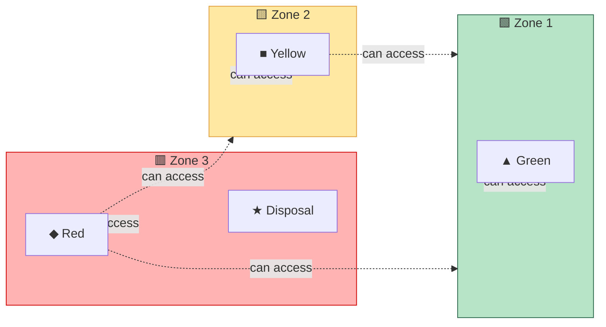
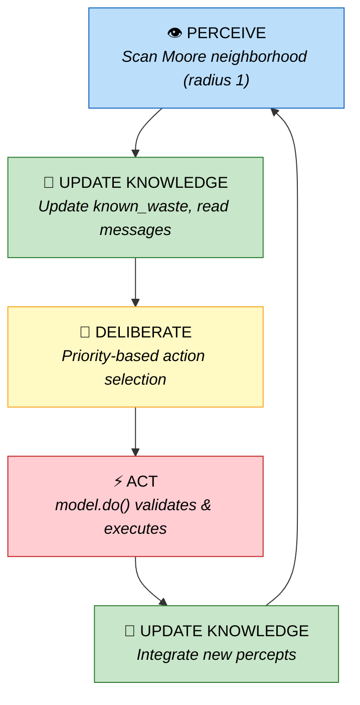
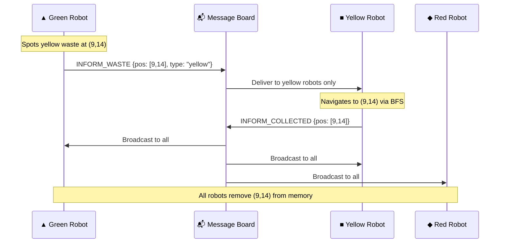
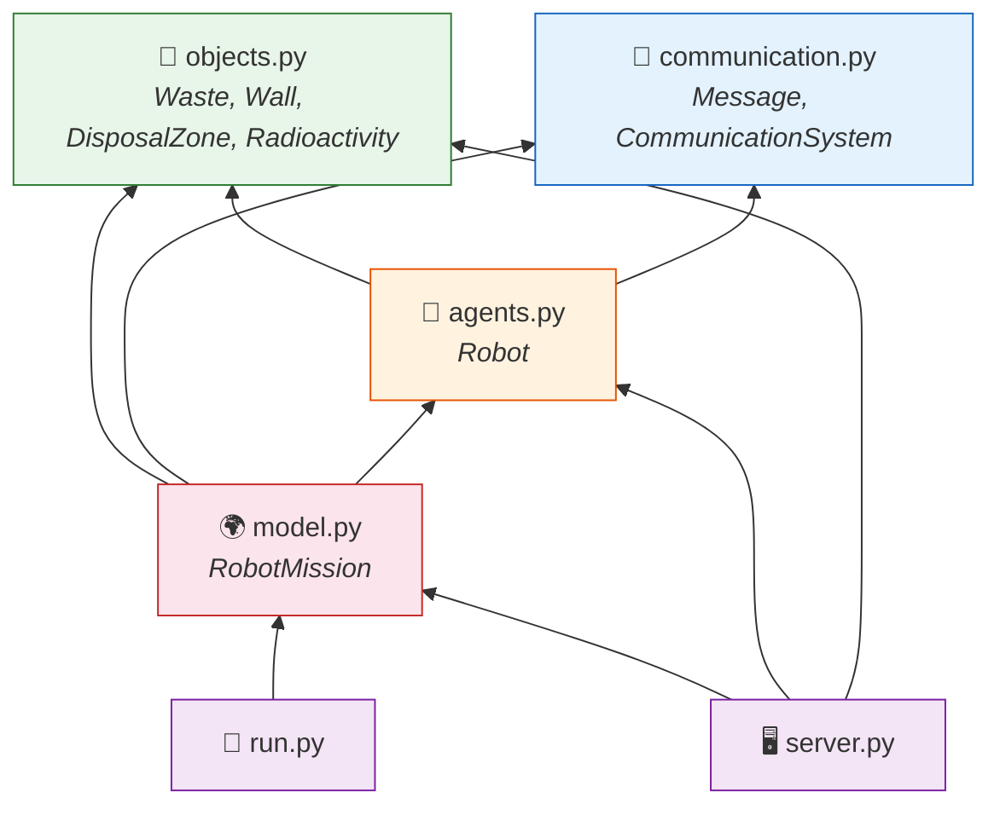

<div align="center">

# ☢️ Self-Organization of Robots in a Hostile Environment

**Autonomous multi-agent radioactive waste cleanup simulation**

[](https://python.org)
[](https://mesa.readthedocs.io)
[](https://solara.dev)
[](LICENSE)

*CentraleSupelec — Multi-Agent Systems 2025-2026*

---

**Three types of robots** &nbsp;·&nbsp; **Three radioactive zones** &nbsp;·&nbsp; **One mission: clean it all up**

</div>

<br>

<!-- ═══════════════════════════════════════════════════════════════════ -->

## 📋 Table of Contents

- [Overview](#-overview)
- [The Environment](#-the-environment)
- [Robots & Waste](#-robots--waste)
- [Transformation Pipeline](#-transformation-pipeline)
- [Agent Architecture](#-agent-architecture)
- [Communication System](#-communication-system)
- [Project Structure](#-project-structure)
- [Getting Started](#-getting-started)
- [Configuration](#%EF%B8%8F-configuration)
- [Metrics & Analysis](#-metrics--analysis)

<br>

<!-- ═══════════════════════════════════════════════════════════════════ -->

## 🔭 Overview

> *How can autonomous robots coordinate to clean up radioactive waste — without any central controller?*

This project simulates a **multi-agent system** where robots of different capabilities must **self-organize** to collect, transform, and dispose of radioactive waste across increasingly dangerous zones. Each robot has limited perception, local knowledge, and must collaborate through message passing.

Built with the **Mesa** agent-based modeling framework and visualized in real-time with **Solara**.

```
   Zone 1 (Safe)          Zone 2 (Medium)         Zone 3 (Danger!)
 ┌─────────────────┬─────────────────────┬─────────────────────┐
 │  🟢 🟢    ▲     │   🟡        ■       │   🔴         ◆      │
 │     🟢  ▲    🧱 │      🟡  ■    🧱    │      🔴   ◆    🧱   │
 │  🟢    ▲  🟢    │   🟡    ■     🟡    │   🔴    ◆      ★    │
 │    ▲       🟢   │     ■         🧱    │     ◆    🔴   🧱    │
 │  🟢   🧱   🟢   │   🟡   🧱     ■     │   🔴   🧱     ◆    │
 └─────────────────┴─────────────────────┴─────────────────────┘
   ▲ Green Robot     ■ Yellow Robot        ◆ Red Robot
   🟢 Green Waste    🟡 Yellow Waste       🔴 Red Waste   ★ Disposal
```

<!-- 📸 Uncomment the line below once you have a screen recording GIF:
<div align="center">
  
  <p><em>Real-time visualization of the waste cleanup mission</em></p>
</div>
-->

<br>

<!-- ═══════════════════════════════════════════════════════════════════ -->

## 🌍 The Environment

The simulation takes place on a **30 x 30 grid** divided into three vertical zones of increasing radioactivity:

<table>
<tr>
<th width="33%">🟩 Zone 1 — Safe</th>
<th width="33%">🟨 Zone 2 — Medium</th>
<th width="33%">🟥 Zone 3 — Danger</th>
</tr>
<tr>
<td>

**Columns:** `0` to `W/3 - 1`
**Radiation:** `0.00 – 0.33`
**Contains:**
- 🟢 Green waste
- ▲ Green robots

</td>
<td>

**Columns:** `W/3` to `2W/3 - 1`
**Radiation:** `0.33 – 0.66`
**Contains:**
- 🟡 Yellow waste
- ■ Yellow robots

</td>
<td>

**Columns:** `2W/3` to `W - 1`
**Radiation:** `0.66 – 1.00`
**Contains:**
- 🔴 Red waste
- ◆ Red robots
- ★ Disposal zone

</td>
</tr>
</table>

> 🧱 **Walls** are randomly placed throughout the grid (never on zone boundaries) and must be navigated around using BFS pathfinding.

<br>

<!-- ═══════════════════════════════════════════════════════════════════ -->

## 🤖 Robots & Waste

### The Three Robot Types

Each robot type has **different zone access** and a **specific mission**:

| | Robot | Symbol | Zone Access | Collects | Produces | Capacity |
|---|---|:---:|---|---|---|:---:|
| 🟩 | **Green** | ▲ | z1 only | 🟢 Green | 🟡 Yellow | 2 |
| 🟨 | **Yellow** | ■ | z1 + z2 | 🟡 Yellow | 🔴 Red | 2 |
| 🟥 | **Red** | ◆ | z1 + z2 + z3 | 🔴 Red | ♻️ Disposed | 2 |

### Zone Access Visualization



<br>

<!-- ═══════════════════════════════════════════════════════════════════ -->

## 🔄 Transformation Pipeline

The waste cleanup follows a **sequential pipeline** — each stage feeds into the next:


<table>
<tr>
<td width="33%">

### Stage 1 — Green Robot ▲
```
  🟢 + 🟢
    ⬇️ TRANSFORM
    🟡
    ⬇️ BFS → zone boundary
    📦 DROP at x = W/3
```

</td>
<td width="33%">

### Stage 2 — Yellow Robot ■
```
  🟡 + 🟡
    ⬇️ TRANSFORM
    🔴
    ⬇️ BFS → zone boundary
    📦 DROP at x = 2W/3
```

</td>
<td width="33%">

### Stage 3 — Red Robot ◆
```
  🔴
    ⬇️ BFS → ★ Disposal
    ♻️ DISPOSED
    ✅ waste_counts["disposed"]++
```

</td>
</tr>
</table>

> **Hand-off mechanism:** When dropping transformed waste at a zone boundary, a robot is allowed to step **one column past** its normal zone limit (`relaxed=True`). This ensures waste is physically placed where the next robot type can reach it.

<br>

<!-- ═══════════════════════════════════════════════════════════════════ -->

## 🧠 Agent Architecture

Every robot follows a **Perceive → Deliberate → Act** loop each simulation step:



### Decision Priorities

The `_deliberate()` function evaluates these priorities **in order** and picks the first match:

| # | Priority | Condition | Action |
|:---:|---|---|---|
| 1️⃣ | **Transform** | Inventory has ≥ N target waste | `TRANSFORM` |
| 2️⃣ | **Deliver** | Red robot + red in inventory | `BFS → Disposal → DROP` |
| 3️⃣ | **Hand-off** | Transformed product in inventory | `BFS → zone boundary → DROP` |
| 4️⃣ | **Pick up** | Target waste on current cell | `PICK` |
| 5️⃣ | **Navigate** | Known target waste in memory | `BFS → nearest waste` |
| 6️⃣ | **Explore** | Nothing else to do | Random walk |

### Knowledge Base

Each robot maintains a local `knowledge` dictionary — there is **no global shared state**:

```python
self.knowledge = {
    "pos":          (x, y),       # Current position
    "inventory":    [],           # Carried waste items
    "carrying":     0,            # len(inventory)
    "known_waste":  {},           # {(x,y): waste_type} — remembered waste locations
    "disposal_pos": None,         # Disposal zone location (if discovered)
    "percepts":     {},           # Latest sensor readings
    "last_action":  "WAIT",
    "steps_idle":   0,            # Anti-deadlock counter
}
```

<details>
<summary><strong>🔍 How BFS Pathfinding Works</strong></summary>

<br>

Robots use **Breadth-First Search** (not greedy movement) to navigate, which automatically handles wall avoidance and zone boundaries:

```python
def _bfs_move(self, target, k, relaxed):
    visited = {pos: None}
    queue   = deque([pos])
    while queue:
        cur = queue.popleft()
        if cur == target: break
        for neighbour in moore_neighbours(cur):
            if neighbour not in visited and self._walkable(neighbour, relaxed):
                visited[neighbour] = cur
                queue.append(neighbour)
    # Backtrack to find the first step of the optimal path
```

Zone constraints are enforced **twice** — in the agent's `_walkable()` and in `model.do()` — with identical formulas:

```python
extra = 1 if relaxed else 0
if robot_type == "green"  and x >= W//3     + extra: return False
if robot_type == "yellow" and x >= 2*W//3   + extra: return False
# red: no restriction
```

</details>

<br>

<!-- ═══════════════════════════════════════════════════════════════════ -->

## 📡 Communication System

Robots communicate through a **centralized message board** — no direct peer-to-peer connections. Messages are **targeted**, not broadcast-only, for efficiency.

### Message Types



| Message | Trigger | Recipients |
|---|---|---|
| `INFORM_WASTE` | Robot spots waste it can't collect | Only robots of the responsible type |
| `INFORM_COLLECTED` | Robot successfully picks up waste | Broadcast to all robots |
| `DISPOSAL_POS` | Robot discovers the disposal zone | Red robots only |

### Delivery Modes

| Mode | Method | Use Case |
|---|---|---|
| **Point-to-point** | `send()` | Direct message to one agent |
| **Group** | `send_to_group()` | Targeted list (e.g., all yellow robots) |
| **Broadcast** | `broadcast()` | All agents (cleared each step) |

<details>
<summary><strong>📬 Stale Entry Cleanup</strong></summary>

<br>

Every `_update_knowledge()` call purges waste positions that no longer hold actual waste on the grid:

```python
stale = [p for p in known_waste
         if not any(isinstance(o, Waste)
                    for o in grid.get_cell_list_contents(p))]
for p in stale:
    del known_waste[p]
```

This prevents robots from chasing waste that's already been collected.

</details>

<br>

<!-- ═══════════════════════════════════════════════════════════════════ -->

## 📁 Project Structure

```
.
├── 📄 .gitignore
├── 📖 README.md
├── 📋 requirements.txt
├── 🚀 run.py                 # Headless CLI runner
├── 🖥️ server.py              # Solara visualization
└── 📦 src/
    ├── __init__.py
    ├── 🤖 agents.py          # Robot class — perceive/deliberate/act loop
    ├── 📡 communication.py   # Message & CommunicationSystem classes
    ├── 🌍 model.py           # RobotMission — environment & action execution
    └── 🧱 objects.py         # Passive objects: Waste, Wall, DisposalZone, Radioactivity
```

### Module Dependency Graph



<br>

<!-- ═══════════════════════════════════════════════════════════════════ -->

## 🚀 Getting Started

### Prerequisites

- **Python 3.11** or **3.12**
- If using Anaconda, run `conda deactivate` first

### Installation

```bash
# Clone the repository
git clone https://github.com/zouaynib/Self-Organization-of-Robots-in-a-Hostile-Environnement.git
cd Self-Organization-of-Robots-in-a-Hostile-Environnement

# Create a virtual environment
python -m venv venv
source venv/bin/activate        # macOS / Linux
# venv\Scripts\activate         # Windows

# Install dependencies
pip install -r requirements.txt
```

### Run the Visualization

```bash
solara run server.py
```

Then open **http://localhost:8765** in your browser.

### Run Headless (No GUI)

```bash
python run.py                     # 200 steps (default)
python run.py --steps 500         # Custom step count
python run.py --steps 300 --csv   # Export metrics to results.csv
python run.py --no-comm           # Disable inter-agent communication
```

<details>
<summary><strong>📊 Example Headless Output</strong></summary>

```
============================================================
Self-organization of Robots — Headless Simulation
============================================================
  Steps        : 200
  Communication: True
------------------------------------------------------------
  Step   50 | Green:   8  Yellow:  12  Red:   5  Disposed:   2  Total:  25
  Step  100 | Green:   2  Yellow:   6  Red:   8  Disposed:   7  Total:  16
  Step  150 | Green:   0  Yellow:   1  Red:   4  Disposed:  14  Total:   5
  Step  200 | Green:   0  Yellow:   0  Red:   0  Disposed:  19  Total:   0

✅  All waste disposed at step 200!
------------------------------------------------------------
Simulation complete.
```

</details>

<br>

<!-- ═══════════════════════════════════════════════════════════════════ -->

## ⚙️ Configuration

The Solara interface provides interactive sliders and toggles:

| Parameter | Default | Range | Description |
|---|:---:|---|---|
| `communication` | `True` | On / Off | Enable inter-agent messaging |
| `n_green_waste` | 20 | 5 – 50 | Initial green waste in z1 |
| `n_yellow_waste` | 10 | 0 – 30 | Initial yellow waste in z2 |
| `n_red_waste` | 5 | 0 – 20 | Initial red waste in z3 |
| `n_walls` | 40 | 0 – 80 | Random wall obstacles |
| `n_green_robots` | 3 | 1 – 6 | Green robot count |
| `n_yellow_robots` | 3 | 1 – 6 | Yellow robot count |
| `n_red_robots` | 3 | 1 – 6 | Red robot count |

<br>

<!-- ═══════════════════════════════════════════════════════════════════ -->

## 📈 Metrics & Analysis

The `DataCollector` records these metrics at every simulation step:

| Metric | Description |
|---|---|
| 🟢 `Green Waste` | Green waste remaining on the grid |
| 🟡 `Yellow Waste` | Yellow waste in circulation |
| 🔴 `Red Waste` | Red waste in circulation |
| ♻️ `Disposed` | Total waste permanently eliminated |
| 📊 `Total Waste` | Sum of all three waste types still active |

These are plotted in real-time in the Solara UI and can be exported with `--csv`.

<br>

<!-- ═══════════════════════════════════════════════════════════════════ -->

## 🎓 Actions Reference

`model.do()` is the **environment arbiter** — it validates every action before executing it:

| Action | Valid When | Effect |
|---|---|---|
| `MOVE` | Adjacent cell, within zone, no wall | Moves the robot |
| `PICK` | Target waste on cell, inventory not full | Removes waste from grid |
| `TRANSFORM` | Inventory ≥ N target waste | Converts N waste → 1 product |
| `DROP` | Inventory not empty | Places waste on grid (or disposes if red @ disposal) |
| `WAIT` | Always | No operation |

<br>

---

<div align="center">

**Built with** ❤️ **at CentraleSupelec — MAS 2025-2026**

</div>
