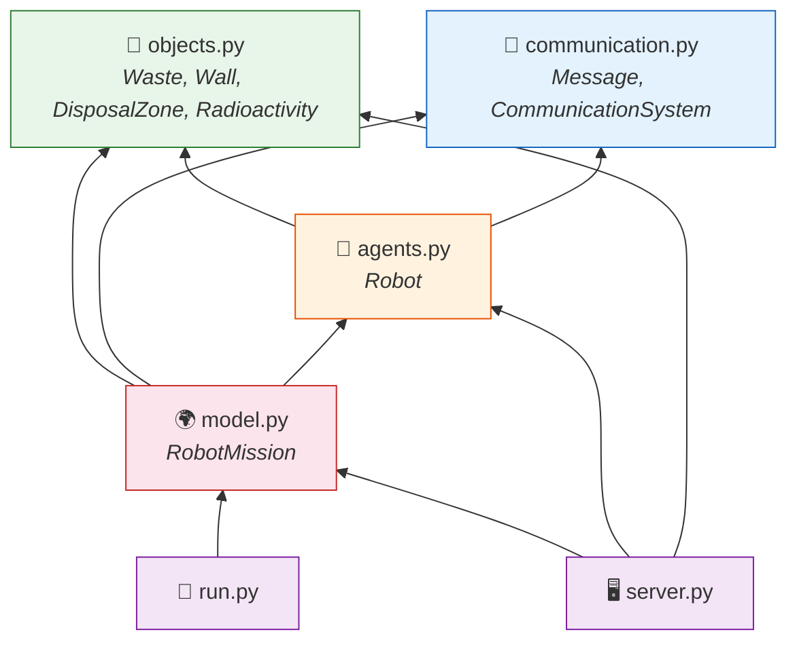
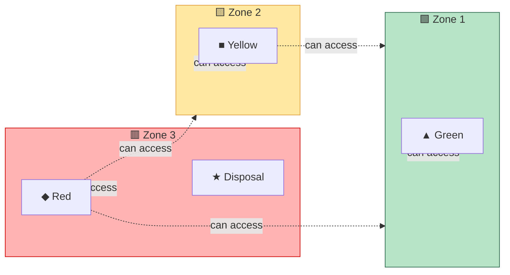
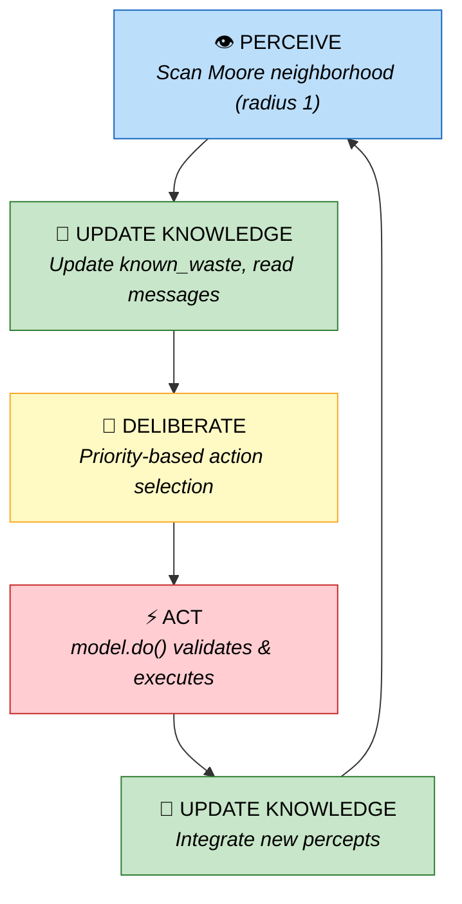
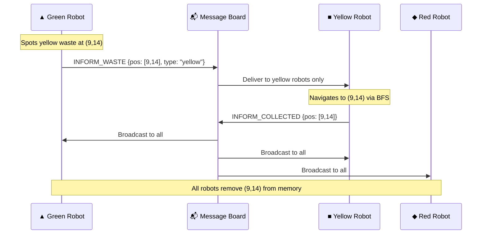

<div align="center">

# ☢️ Self-Organization of Robots in a Hostile Environment

**Autonomous multi-agent radioactive waste cleanup simulation**

[](https://python.org)
[](https://mesa.readthedocs.io)
[](https://solara.dev)
[](LICENSE)

*CentraleSupélec — Multi-Agent Systems 2025-2026*

---

**Three types of robots** &nbsp;·&nbsp; **Three radioactive zones** &nbsp;·&nbsp; **One mission: clean it all up**

</div>


## 🎥 Demo Video

> Watch the robots coordinate, navigate, transform waste, and clean the hostile environment in real time.

<div align="center">

[](https://www.youtube.com/watch?v=WDXd6ve8NxA)

### ▶️ [Click here to watch the demo on YouTube](https://www.youtube.com/watch?v=WDXd6ve8NxA)

</div>
---

## 📋 Table of Contents

1. [Overview](#-overview)
2. [Project Structure](#-project-structure)
3. [The Environment](#-the-environment)
4. [Robots & Waste](#-robots--waste)
5. [Transformation Pipeline](#-transformation-pipeline)
6. [Agent Architecture](#-agent-architecture)
7. [Global Agent Strategy](#-global-agent-strategy)
8. [Navigation Methods](#-navigation-methods)
   - BFS Navigation
   - A* under Partial Observability (Bonus)
9. [Communication System](#-communication-system)
10. [Actions & `model.do()`](#-actions--modeldo)
11. [Bonus Optimization: A* Navigation under Partial Observability](#-bonus-optimization-a-navigation-under-partial-observability)
12. [Getting Started](#-getting-started)
13. [Configuration](#️-configuration)
14. [Metrics & Analysis](#-metrics--analysis)

---

## 🔭 Overview

> *How can autonomous robots coordinate to clean up radioactive waste — without any central controller?*

This project simulates a **multi-agent system** where robots of different capabilities must **self-organize** to collect, transform, and dispose of radioactive waste across increasingly dangerous zones. Each robot has limited perception, local knowledge, and must collaborate through message passing.

Built with the **Mesa** agent-based modeling framework (Python) and visualized in real-time with **Solara**. It illustrates core MAS concepts: perception, deliberation, action, memory, and communication.

```
   Zone 1 (Safe)          Zone 2 (Medium)         Zone 3 (Danger!)
 ┌─────────────────┬─────────────────────┬─────────────────────┐
 │  🟢 🟢    ▲     │   🟡        ■       │   🔴         ◆      │
 │     🟢  ▲    🧱 │      🟡  ■    🧱    │      🔴   ◆    🧱   │
 │  🟢    ▲  🟢    │   🟡    ■     🟡    │   🔴    ◆      ★    │
 │    ▲       🟢   │     ■         🧱    │     ◆    🔴   🧱    │
 │  🟢   🧱   🟢   │   🟡   🧱     ■     │   🔴   🧱     ◆    │
 └─────────────────┴─────────────────────┴─────────────────────┘
   ▲ Green Robot     ■ Yellow Robot        ◆ Red Robot
   🟢 Green Waste    🟡 Yellow Waste       🔴 Red Waste   ★ Disposal
```

---

## 📁 Project Structure

```
.
├── 📄 .gitignore
├── 📖 README.md
├── 📋 requirements.txt
├── 🚀 run.py # Main script to launch simulation
├── 🖥️ server.py # Solara interactive visualization
│
├── 📦 src/
│ ├── init.py
│ ├── 🤖 agents.py # Robot behavior (BDI logic)
│ ├── 📡 communication.py # Communication between agents
│ ├── 🌍 model.py # Environment & simulation dynamics
│ └── 🧱 objects.py # Waste, walls, disposal zones
│
├── 🧠 Bonus_Optimisation_A*/ # Advanced navigation (bonus part)
│ ├── animate.py # Generates simulation animation
│ ├── viz.py # Visualization utilities
│ ├── run.py # Runs optimized simulation
│ ├── server.py # Visualization for optimized version
│ ├── grid.png # Environment snapshot
│ ├── metrics.png # Performance metrics visualization
│ ├── simulation.gif # Animated simulation result
│ └── results.csv # Quantitative results
```

| Fichier | Rôle | Classes principales |
|---|---|---|
| `agents.py` | Logique décisionnelle complète de chaque robot | `Robot` |
| `model.py` | Grille, placement des agents, méthode `do()` | `RobotMission` |
| `objects.py` | Agents passifs sans comportement | `Waste`, `Wall`, `DisposalZone`, `Radioactivity` |
| `communication.py` | Boîte aux lettres centrale | `CommunicationSystem`, `Message` |
| `server.py` | Interface Solara avec zones colorées et métriques | — |
| `run.py` | Simulation sans GUI avec sortie console | — |

### Module Dependency Graph



---

## 🌍 The Environment

The simulation takes place on a **30 × 30 grid** divided into three vertical zones of increasing radioactivity:

<table>
<tr>
<th width="33%">🟩 Zone 1 — Safe</th>
<th width="33%">🟨 Zone 2 — Medium</th>
<th width="33%">🟥 Zone 3 — Danger</th>
</tr>
<tr>
<td>

**Columns:** `0` to `W/3 - 1`  
**Radiation:** `0.00 – 0.33`  
**Contains:**
- 🟢 Green waste
- ▲ Green robots

</td>
<td>

**Columns:** `W/3` to `2W/3 - 1`  
**Radiation:** `0.33 – 0.66`  
**Contains:**
- 🟡 Yellow waste
- ■ Yellow robots

</td>
<td>

**Columns:** `2W/3` to `W - 1`  
**Radiation:** `0.66 – 1.00`  
**Contains:**
- 🔴 Red waste
- ◆ Red robots
- ★ Disposal zone

</td>
</tr>
</table>

Each cell contains a passive `Radioactivity` agent whose level is drawn randomly from its zone's range. **Walls** (`Wall`) are placed randomly throughout the grid, never on the zone boundary columns `W/3` and `2W/3`, to guarantee passage between zones.

---

## 🤖 Robots & Waste

### The Three Waste Types

| Type | Color | Origin |
|---|---|---|
| Green | 🟢 | Present from the start in z1 |
| Yellow | 🟡 | Present in z2 + created by transforming 2 green |
| Red | 🔴 | Present in z3 + created by transforming 2 yellow |

### The Three Robot Types

Each robot type has **different zone access** and a **specific mission**:

| | Robot | Symbol | Zone Access | Collects | Produces | Capacity |
|---|---|:---:|---|---|---|:---:|
| 🟩 | **Green** | ▲ | z1 only (`x < W/3`) | 🟢 Green | 🟡 Yellow | 2 |
| 🟨 | **Yellow** | ■ | z1 + z2 (`x < 2W/3`) | 🟡 Yellow | 🔴 Red | 2 |
| 🟥 | **Red** | ◆ | z1 + z2 + z3 (all) | 🔴 Red | ♻️ Disposed | 1 |

### Zone Access Visualization



---

## 🔄 Transformation Pipeline

The waste cleanup follows a **sequential pipeline** — each stage feeds into the next:


<table>
<tr>
<td width="33%">

**Stage 1 — Green Robot ▲**
```
  🟢 + 🟢
    ⬇️ TRANSFORM
    🟡
    ⬇️ BFS → zone boundary
    📦 DROP at x = W/3
```

</td>
<td width="33%">

**Stage 2 — Yellow Robot ■**
```
  🟡 + 🟡
    ⬇️ TRANSFORM
    🔴
    ⬇️ BFS → zone boundary
    📦 DROP at x = 2W/3
```

</td>
<td width="33%">

**Stage 3 — Red Robot ◆**
```
  🔴
    ⬇️ BFS → ★ Disposal
    ♻️ DISPOSED
    ✅ waste_counts["disposed"]++
```

</td>
</tr>
</table>

Transformations happen entirely **in memory** (in the inventory). The waste only appears physically on the grid at the moment of `DROP`. When dropping at a zone boundary, the robot is allowed to step **one column past** its normal zone limit (`relaxed=True`), ensuring waste is placed where the next robot type can reach it.

---

## 🧠 Agent Architecture

### Perceive → Deliberate → Act Loop

At each step, every robot executes the `step()` method:

```python
def step(self):
    percepts     = self._perceive()                  # Scan Moore neighborhood (radius 1)
    self._update_knowledge(percepts)                 # Update known_waste, read messages
    action       = self._deliberate(self.knowledge)  # Priority-based action selection
    new_percepts = self.model.do(self, action)        # model validates & executes
    self._update_knowledge(new_percepts)             # Integrate feedback
    self.knowledge["last_action"] = action["type"]
```



### Knowledge Base

Each robot maintains a local `knowledge` dictionary — there is **no global shared state**:

```python
self.knowledge = {
    "pos":          (x, y),    # Current position
    "inventory":    [],        # Carried waste items
    "carrying":     0,         # len(inventory)
    "percepts":     {},        # Latest sensor readings
    "known_waste":  {},        # {(x,y): waste_type} — remembered waste locations
    "disposal_pos": None,      # Disposal zone location (if discovered)
    "last_action":  "WAIT",
    "steps_idle":   0,         # Anti-deadlock counter
}
```

### Decision Priorities

`_deliberate()` is a **pure function** on `knowledge`. It evaluates these priorities **in strict order** and picks the first match:

| # | Priority | Condition | Action |
|:---:|---|---|---|
| 1️⃣ | **Transform** | Inventory has ≥ N target waste | `TRANSFORM` |
| 2️⃣ | **Deliver** | Red robot + red in inventory | `BFS → Disposal → DROP` |
| 3️⃣ | **Hand-off** | Transformed product in inventory | `BFS → zone boundary → DROP` |
| 4️⃣ | **Pick up** | Target waste on current cell | `PICK` |
| 5️⃣ | **Navigate** | Known target waste in memory | `BFS → nearest waste` |
| 6️⃣ | **Explore** | Nothing else to do | Random walk |

---


## 🧠 Global Agent Strategy

The behavior of the robots is based on a hierarchical strategy that combines local perception, memory, communication, and planning.

---

### ⚡ 1. Priority to Critical Actions

Each robot follows an ordered decision-making logic:

- Transform waste when the inventory is sufficient  
- Drop transformed waste at strategic locations  
- Pick up a target waste present on the current cell  
- Move toward a known waste location (from memory)  
- Explore randomly when no information is available  

This strategy ensures consistent and efficient decision-making.

---

### 🧭 2. Optimized Navigation

Robots rely on the **Breadth-First Search (BFS)** algorithm to:

- find the shortest path  
- avoid obstacles  
- respect zone constraints  

This significantly improves movement efficiency.

---

### 📡 3. Targeted Communication

Agents exchange only relevant information:

- sharing waste locations  
- synchronizing after collection  
- transmitting critical positions  

This reduces unnecessary communication and improves coordination.

---

### 🧠 4. Memory Usage

Each robot maintains a knowledge base including:

- observed waste positions  
- disposal zone location  
- action history  

Outdated information is dynamically removed to prevent incorrect decisions.

---

### 🤝 5. Emergent Coordination

Coordination emerges without central control through:

- role specialization (green, yellow, red robots)  
- a structured transformation pipeline  
- targeted information sharing  

This enables an efficient and scalable collective organization.


## 🧭 Navigation Methods

### 🔹 BFS Navigation (Baseline)

In the baseline implementation, robots use **Breadth-First Search (BFS)** to reach known targets (e.g., waste or disposal zones).

This guarantees:
- Shortest path in a known environment  
- Automatic obstacle avoidance  
- Respect of zone constraints  


def _bfs_move(self, target, k, relaxed):
    visited = {pos: None}
    queue   = deque([pos])

    while queue:
        cur = queue.popleft()

        if cur == target:
            break

        for neighbour in moore_neighbours(cur):
            if neighbour not in visited and self._walkable(neighbour, relaxed):
                visited[neighbour] = cur
                queue.append(neighbour)


Zone constraints are enforced through a double-check mechanism:
extra = 1 if relaxed else 0

if robot_type == "green"  and x >= W//3   + extra: return False
if robot_type == "yellow" and x >= 2*W//3 + extra: return False


The relaxed=True parameter allows robots to slightly cross boundaries only when necessary (e.g., waste transfer).


### 🔹 A* under Partial Observability (Bonus)


In the advanced version, BFS is replaced by a more realistic approach:

Each robot has a limited field of view (5×5 grid)
Robots maintain an internal partial map (memory)
Unknown cells are assumed free (optimistic planning)
Pathfinding is done using A* instead of BFS

If an obstacle is discovered:

The robot replans immediately using updated knowledge

When no target is known:

Robots switch to frontier-based exploration
They move toward the boundary between known and unknown areas

This approach enables:

Autonomous exploration
Adaptive decision-making
Realistic behavior under uncertainty

 This implementation is available in the Bonus_Optimisation_A* folder.
---

## 📡 Communication System

Robots communicate through a **centralized message board** (`model.communication_system`) — no direct peer-to-peer connections. Messages are **targeted by type** for efficiency.

### Message Types

| Message | Trigger | Recipients |
|---|---|---|
| `INFORM_WASTE` | Robot spots waste it can't collect | Only robots of the responsible type |
| `INFORM_COLLECTED` | Robot successfully picks up waste | Broadcast to all robots |
| `DISPOSAL_POS` | Robot discovers the disposal zone | Red robots only |

### Delivery Modes

| Mode | Method | Use Case |
|---|---|---|
| **Point-to-point** | `send()` | Direct message to one agent |
| **Group** | `send_to_group()` | Targeted list (e.g., all yellow robots) |
| **Broadcast** | `broadcast()` | All agents (cleared each step) |

### Example Flow



### Red Robot Initialization

The position of the `DisposalZone` is **pre-filled** in the knowledge of all red robots at model initialization, avoiding unnecessary exploration:

```python
for agent in self.agents:
    if isinstance(agent, Robot) and agent.robot_type == "red":
        agent.knowledge["disposal_pos"] = self._disposal_pos
```

### Stale Entry Cleanup

Every `_update_knowledge()` call purges waste positions that no longer hold actual waste on the grid, preventing robots from chasing waste that's already been collected:

```python
stale = [p for p in known_waste
         if not any(isinstance(o, Waste)
                    for o in grid.get_cell_list_contents(p))]
for p in stale:
    del known_waste[p]
```

---

## ⚙️ Actions & `model.do()`

The model is the **arbiter** of all actions. `do(agent, action)` validates each action before executing it and returns the new percepts:

| Action | Valid When | Effect |
|---|---|---|
| `MOVE` | Adjacent cell, within zone, no wall | Moves the robot |
| `PICK` | Target waste on cell, inventory not full | Removes waste from grid |
| `TRANSFORM` | Inventory ≥ N target waste | Converts N waste → 1 product |
| `DROP` | Inventory not empty | Places waste on grid (or disposes if red @ disposal) |
| `WAIT` | Always | No operation |

---


## 🧠 Bonus Optimization: A* Navigation under Partial Observability

### 🔹 Motivation

The baseline navigation strategy relies on **Breadth-First Search (BFS)** and assumes that the environment is fully known.

However, this assumption is unrealistic in real-world scenarios where agents have **limited perception**.

To overcome this limitation, we introduce an advanced navigation approach based on:
- Partial observability  
- Incremental knowledge  
- Adaptive planning  

---

### 🔹 Key Idea

Each robot operates with **local perception only**:

- Field of view limited to a **5×5 grid**  
- No direct access to the full environment  
- Maintains an internal **partial map (`known_map`)**  

Unknown cells are treated as **free (optimistic assumption)** to allow exploration and avoid deadlock situations.

---

### 🔹 A* Path Planning

Instead of BFS, robots use the **A\*** algorithm:

- Heuristic-based search (more efficient than BFS)  
- Operates on the robot’s **partial knowledge**  
- Computes paths even in partially unknown environments  

If a robot discovers that a planned path is invalid (e.g., obstacle detected):
- It **replans immediately** using updated information  

---

### 🔹 Frontier-Based Exploration

When no known target (waste or disposal zone) is available:

- Robots identify **frontier cells**  
  (boundary between explored and unexplored areas)  
- Move toward the nearest frontier  
- Gradually expand their knowledge of the environment  

This ensures efficient and structured exploration.

---

### 🔹 Advantages

- More realistic agent behavior  
- No reliance on global information  
- Adaptive decision-making under uncertainty  
- Efficient exploration of unknown environments  
- Better scalability for larger maps  

---

### 🔹 Implementation

This optimization is implemented in the folder:Bonus_Optimisation_A*;

It contains:
- A* navigation implementation  
- Visualization tools (`viz.py`, `server.py`)  
- Simulation runner (`run.py`)  
- Performance outputs (`metrics.png`, `results.csv`)  
- Animation (`simulation.gif`)  

---

### 🔹 Results

The optimized approach demonstrates:

- Faster environment exploration  
- Improved target discovery  
- More robust navigation in presence of obstacles  
- Smarter and more adaptive robot behavior  

---

💡 This bonus highlights the transition from a **classical search algorithm (BFS)**  
to a more **advanced AI-based navigation strategy under uncertainty**.


## 🚀 Getting Started

### Prerequisites

- **Python 3.11** or **3.12**
- If using Anaconda, run `conda deactivate` first

### Installation

```bash
# Clone the repository
git clone https://github.com/zouaynib/Self-Organization-of-Robots-in-a-Hostile-Environnement.git
cd Self-Organization-of-Robots-in-a-Hostile-Environnement

# Create a virtual environment
python -m venv venv
source venv/bin/activate          # macOS / Linux
# venv\Scripts\Activate.ps1      # Windows PowerShell

# Install dependencies
pip install mesa==3.1.4 solara matplotlib pandas
# or:
pip install -r requirements.txt
```

### Run the Visualization

```bash
solara run server.py
```

Then open **http://localhost:8765** in your browser.

### Run Headless (No GUI)

```bash
python run.py                     # 200 steps (default)
python run.py --steps 500         # Custom step count
python run.py --steps 300 --csv   # Export metrics to results.csv
python run.py --no-comm           # Disable inter-agent communication
```

<details>
<summary><strong>📊 Example Headless Output</strong></summary>

```
============================================================
Self-organization of Robots — Headless Simulation
============================================================
  Steps        : 200
  Communication: True
------------------------------------------------------------
  Step   50 | Green:   8  Yellow:  12  Red:   5  Disposed:   2  Total:  25
  Step  100 | Green:   2  Yellow:   6  Red:   8  Disposed:   7  Total:  16
  Step  150 | Green:   0  Yellow:   1  Red:   4  Disposed:  14  Total:   5
  Step  200 | Green:   0  Yellow:   0  Red:   0  Disposed:  19  Total:   0

✅  All waste disposed at step 200!
------------------------------------------------------------
Simulation complete.
```

</details>

---

## 🛠️ Configuration

The Solara interface provides interactive sliders and toggles:

| Parameter | Default | Range | Description |
|---|:---:|---|---|
| `communication` | `True` | On / Off | Enable inter-agent messaging |
| `n_green_waste` | 20 | 5 – 50 | Initial green waste in z1 |
| `n_yellow_waste` | 10 | 0 – 30 | Initial yellow waste in z2 |
| `n_red_waste` | 5 | 0 – 20 | Initial red waste in z3 |
| `n_walls` | 40 | 0 – 80 | Random wall obstacles |
| `n_green_robots` | 3 | 1 – 6 | Green robot count |
| `n_yellow_robots` | 3 | 1 – 6 | Yellow robot count |
| `n_red_robots` | 3 | 1 – 6 | Red robot count |

---

## 📈 Metrics & Analysis

The `DataCollector` records these metrics at every simulation step:

| Metric | Description |
|---|---|
| 🟢 `Green Waste` | Green waste remaining on the grid |
| 🟡 `Yellow Waste` | Yellow waste in circulation |
| 🔴 `Red Waste` | Red waste in circulation |
| ♻️ `Disposed` | Total waste permanently eliminated |
| 📊 `Total Waste` | Sum of all three waste types still active |

These are plotted in real-time in the Solara UI and exported to `results.csv` when using the `--csv` flag.

---

<div align="center">

**Built with** ❤️ **at CentraleSupélec — MAS 2025-2026**

</div>
